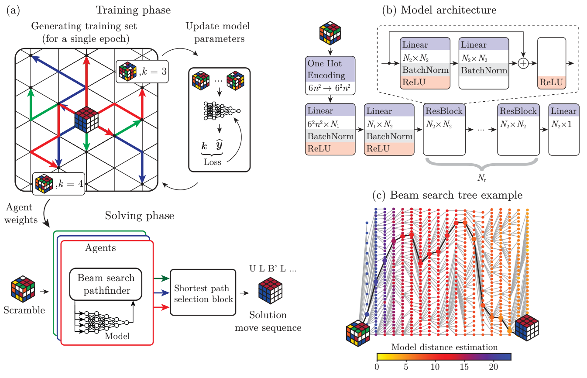

# CayleyPy: Machine Learning-based Puzzle Solver

> **Based on the research paper:** [A machine learning approach that beats large Rubik’s cubes](https://www.arxiv.org/pdf/2502.13266)

This repository provides a general-purpose machine learning-based solver for finding short paths on Cayley graphs of arbitrary finite groups. Given any group defined by a set of allowed permutations and a target state, the solver learns to navigate toward the goal efficiently.

As a prominent example, the method demonstrates state-of-the-art performance on Rubik’s cubes up to size 5x5x5. However, it also generalizes to other permutation puzzles like Pancake Sorting and the 15 Puzzle.

The approach leverages a neural network to estimate diffusion distances to the goal and guides a beam search through extremely large state spaces. Notably, the model can learn effective heuristics in just a few minutes of training even on non-trivial group structures.



## Installation

```bash
git clone https://github.com/your-repo/ml-puzzle-solver.git
cd ml-puzzle-solver
pip install -r requirements.txt
```

Requires Python 3.10+ and PyTorch.

## Overview

The method:

* Uses beam search guided by neural network predictions.
* Achieves optimality rates exceeding 98% for the 3x3x3 Rubik’s cube.
* Outperforms competitors on larger cubes (4x4x4, 5x5x5) significantly.

## Performance Highlights

| Puzzle     | Dataset         | Avg. Solution Length |
| ---------- | --------------- | -------------------- |
| Cube 3x3x3 | DeepCubeA (QTM) | 20.7                 |
| Cube 4x4x4 | Santa 2023      | 46.5                 |
| Cube 5x5x5 | Santa 2023      | 92.2                 |


## Training Your Model

To train a model with your puzzle configuration:

```bash
python train.py --group_id <id> --target_id 0 --epochs <epochs> --hd1 <N_1> --hd2 <N_2> --nrd <N_r> --batch_size 10000 --K_max <K_max> --device_id 0
```

Example for Puzzle 24:

```bash
python train.py --group_id 28 --target_id 0 --epochs 16 --hd1 1024 --hd2 512 --nrd 1 --batch_size 10000 --K_max 100 --device_id 0
```

After training, use the generated `model_id` to run beam search evaluation:

```bash
python test.py --group_id 28 --target_id 0 --tests_num 3 --dataset rnd --num_steps 300 --num_attempts 1 --verbose 1 --epoch 16 --model_id {MODEL_ID} --B 65536 --device_id 0
```

Replace `{MODEL_ID}` with the numeric identifier found in the logs.

## Adding New Puzzle Groups

To add your puzzle:

* Define puzzle moves in the `generators` folder as `pXXX.json`.
* Add target states as tensors (`t000.pt`, `t001.pt`, etc.) in the `targets` folder.
* Add scramble datasets (2D tensor, each row a scramble) to the `datasets` folder.

Multiple target states (`t000`, `t001`, ...) are supported for each puzzle group.


## Testing Pre-trained Models

Run tests using preloaded models:

**Cube 3x3x3 (UQTM metric)**

```bash
python test.py --group_id 1 --target_id 0 --tests_num 3 --dataset santa --num_steps 100 --verbose 1 --epoch 8192 --model_id 333 --B 262144 --device_id 0
```

**Cube 4x4x4 (UQTM metric)**

```bash
python test.py --group_id 2 --target_id 0 --tests_num 3 --dataset santa --num_steps 150 --verbose 1 --epoch 8192 --model_id 444 --B 262144 --device_id 0
```

**Cube 5x5x5 (UQTM metric)**

```bash
python test.py --group_id 3 --target_id 0 --tests_num 3 --dataset santa --num_steps 200 --verbose 1 --epoch 8192 --model_id 555 --B 524288 --device_id 0
```

**Cube 3x3x3 (QTM metric)**

```bash
python test.py --group_id 54 --target_id 0 --tests_num 3 --dataset deepcubea --num_steps 100 --verbose 1 --epoch 8192 --model_id 333 --B 262144 --device_id 0
```


## Available Groups and Kmax

| Group ID | Puzzle                        |
| -------- | ----------------------------- |
| 000      | Cube 2x2x2                    |
| 001      | Cube 3x3x3                    |
| 002      | Cube 4x4x4                    |
| 003      | Cube 5x5x5                    |
| 004      | Cube 6x6x6                    |
| 011      | Wreath 6/6                    |
| 012      | Wreath 7/7                    |
| 013      | Wreath 12/12                  |
| 014      | Wreath 21/21                  |
| 015      | Wreath 33/33                  |
| 017      | Globe 1/8                     |
| 018      | Globe 1/16                    |
| 019      | Globe 2/6                     |
| 020      | Globe 3/4                     |
| 021      | Globe 6/4                     |
| 022      | Globe 6/8                     |
| 023      | Globe 6/10                    |
| 024      | Globe 3/33                    |
| 025      | Globe 8/25                    |
| 026      | Puzzle 8                      |
| 027      | Puzzle 15                     |
| 028      | Puzzle 24                     |
| 029      | Puzzle 35                     |
| 030      | Puzzle 48                     |
| 031      | Puzzle 63                     |
| 034      | LRX 10                        |
| 035      | LRX 15                        |
| 036      | LRX 20                        |
| 037      | LRX 25                        |
| 044      | Pancake 10                    |
| 045      | Pancake 15                    |
| 046      | Pancake 20                    |
| 047      | Pancake 25                    |
| 048      | Pancake 30                    |
| 049      | Pancake 35                    |
| 050      | Pancake 40                    |
| 051      | Pancake 45                    |
| 052      | Pancake 50                    |
| 053      | Pancake 55                    |
| 054      | Cube 3x3x3 (DeepCubeA metric) |


For more details and advanced usage, refer to the associated [research paper](https://www.arxiv.org/pdf/2502.13266).
